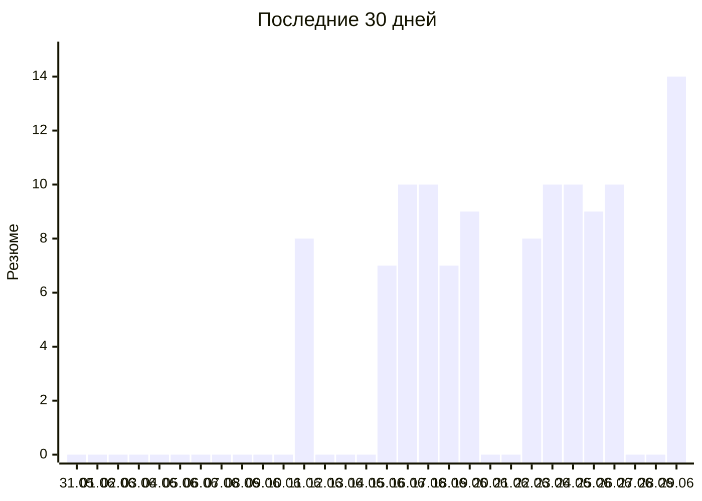

# Отклики по дням

Автообновляется со страницы [day-runner](https://konicaru.github.io/day-runner/).

## По дням

| Дата | Резюме |
|---|---:|
| 2026-06-29 (пн) | 14 |
| 2026-06-26 (пт) | 10 |
| 2026-06-25 (чт) | 9 |
| 2026-06-24 (ср) | 10 |
| 2026-06-23 (вт) | 10 |
| 2026-06-22 (пн) | 8 |
| 2026-06-19 (пт) | 9 |
| 2026-06-18 (чт) | 7 |
| 2026-06-17 (ср) | 10 |
| 2026-06-16 (вт) | 10 |
| 2026-06-15 (пн) | 7 |
| 2026-06-11 (чт) | 8 |
| **Итого** | **112** |
