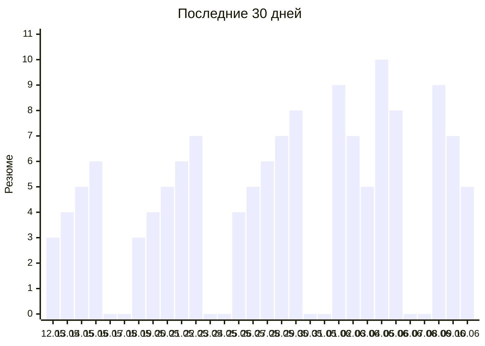
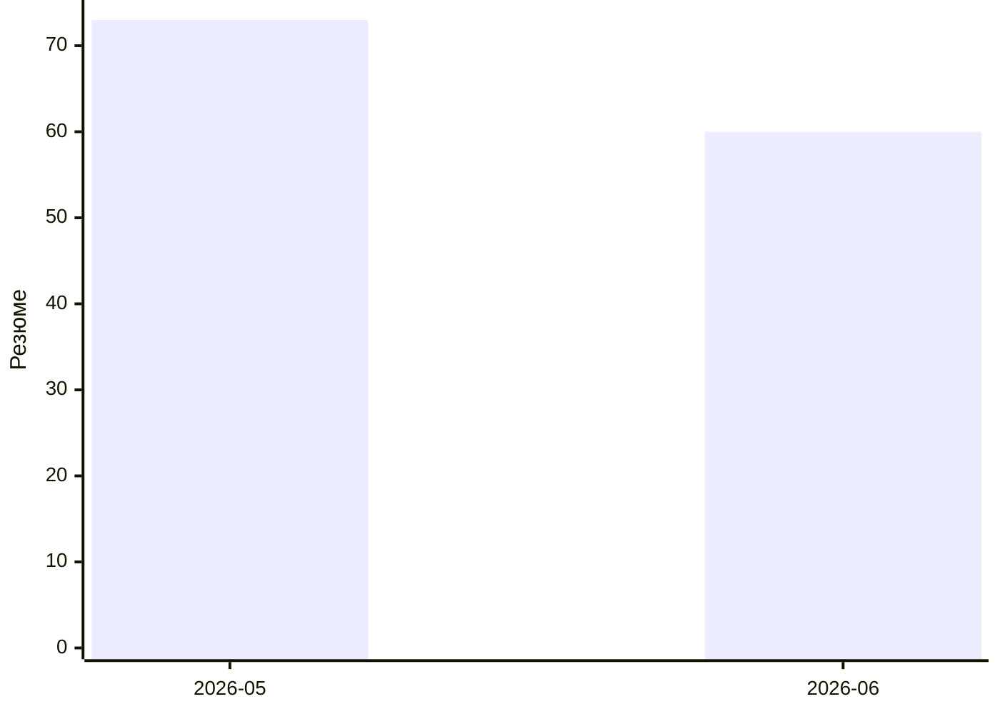

# Отклики по дням

Автообновляется со страницы [day-runner](https://konicaru.github.io/day-runner/).

## По месяцам

| Месяц | Резюме |
|---|---:|
| 2026-06 | 60 |
| 2026-05 | 73 |

## По дням

| Дата | Резюме |
|---|---:|
| 2026-06-10 (ср) | 5 |
| 2026-06-09 (вт) | 7 |
| 2026-06-08 (пн) | 9 |
| 2026-06-05 (пт) | 8 |
| 2026-06-04 (чт) | 10 |
| 2026-06-03 (ср) | 5 |
| 2026-06-02 (вт) | 7 |
| 2026-06-01 (пн) | 9 |
| 2026-05-29 (пт) | 8 |
| 2026-05-28 (чт) | 7 |
| 2026-05-27 (ср) | 6 |
| 2026-05-26 (вт) | 5 |
| 2026-05-25 (пн) | 4 |
| 2026-05-22 (пт) | 7 |
| 2026-05-21 (чт) | 6 |
| 2026-05-20 (ср) | 5 |
| 2026-05-19 (вт) | 4 |
| 2026-05-18 (пн) | 3 |
| 2026-05-15 (пт) | 6 |
| 2026-05-14 (чт) | 5 |
| 2026-05-13 (ср) | 4 |
| 2026-05-12 (вт) | 3 |
| **Итого** | **133** |
