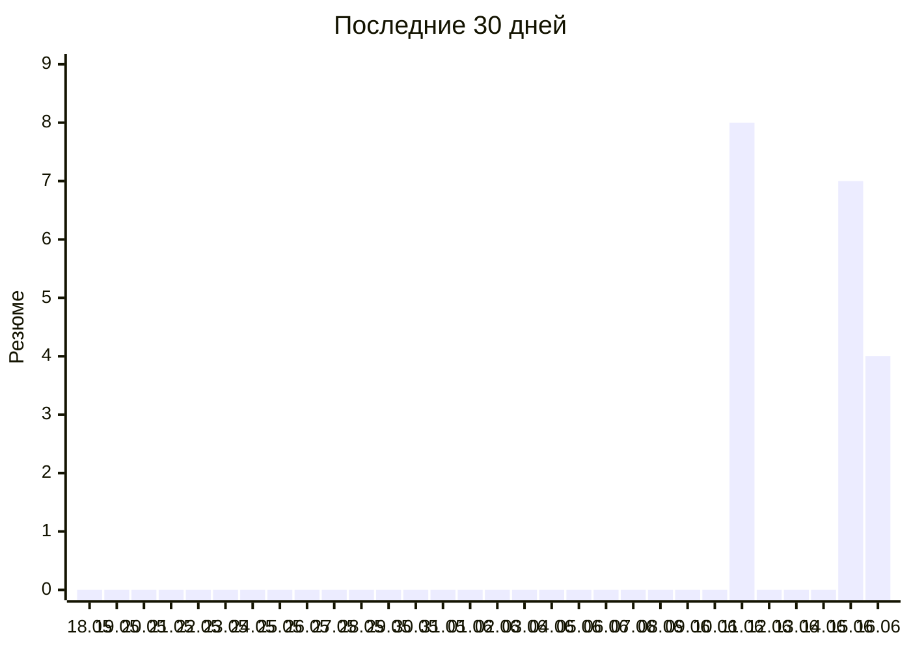

# Отклики по дням

Автообновляется со страницы [day-runner](https://konicaru.github.io/day-runner/).

## По дням

| Дата | Резюме |
|---|---:|
| 2026-06-16 (вт) | 4 |
| 2026-06-15 (пн) | 7 |
| 2026-06-11 (чт) | 8 |
| **Итого** | **19** |
